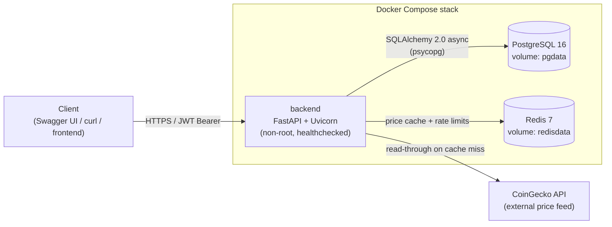
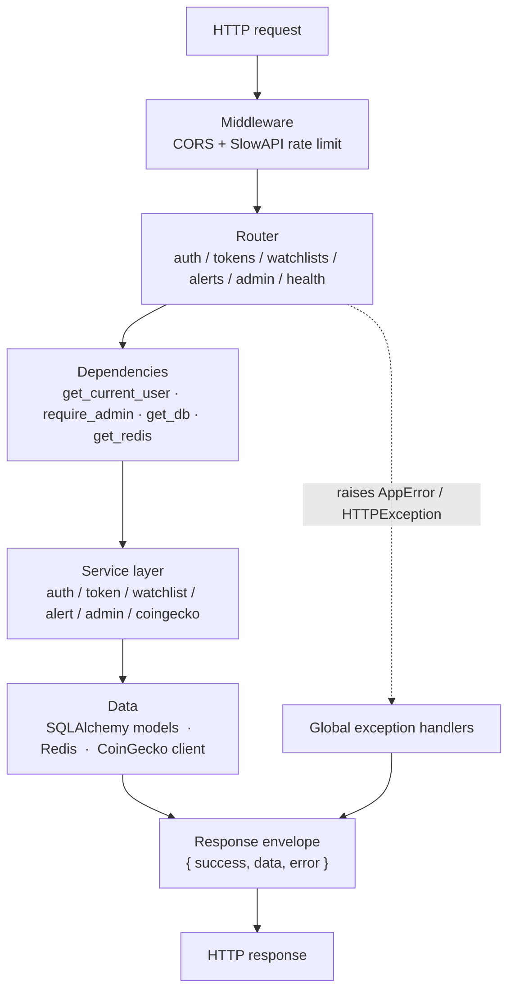
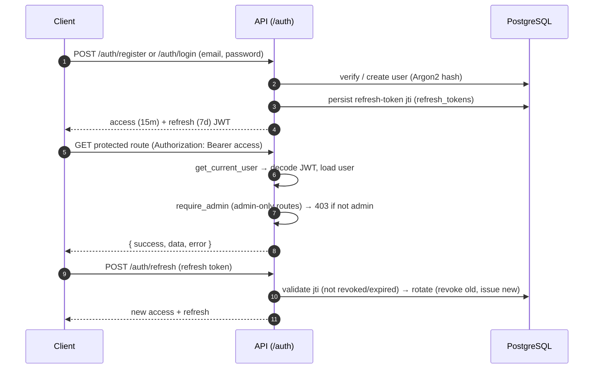
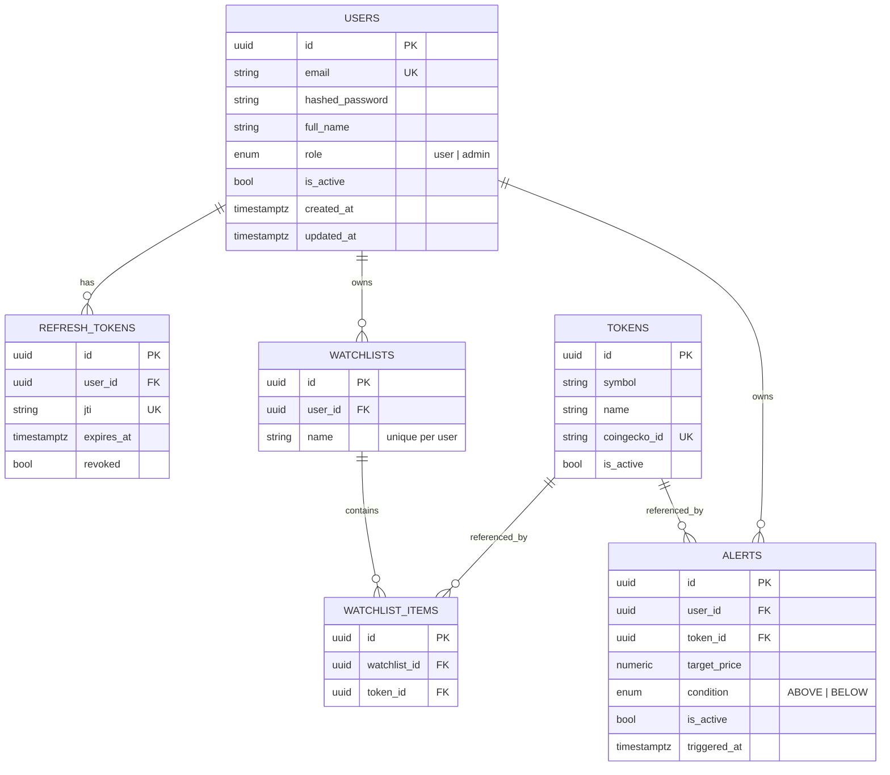
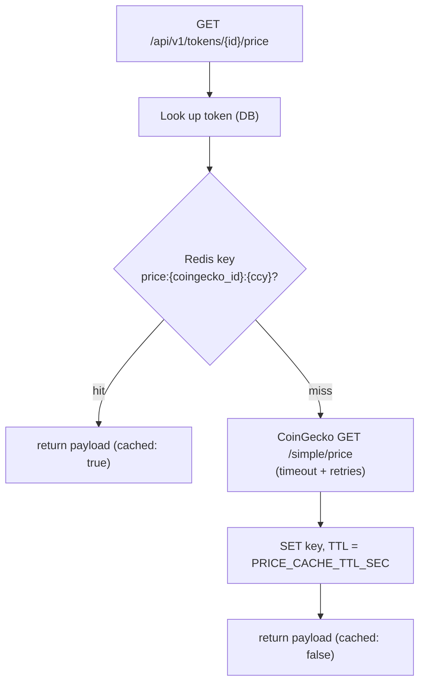

# Watchtower — Architecture

A FastAPI backend that serves a crypto **watchlist & price-alert** API, backed by
PostgreSQL (system of record) and Redis (price cache + rate-limit store), with
CoinGecko as the external price feed.

## System context

## Request lifecycle (layers)

## Authentication & RBAC

## Data model

## Price read-through cache

## Component overview

| Layer | Modules | Responsibility |
|---|---|---|
| Routers | `app/routers/{auth,tokens,watchlists,alerts,admin,health}.py` | HTTP surface, validation, envelope responses, OpenAPI docs |
| Dependencies | `app/deps/auth.py` | `get_current_user`, `require_admin` (RBAC), DB/Redis injection |
| Services | `app/services/*` | Business logic (auth, token catalogue + cache, watchlists, alerts, admin, CoinGecko client) |
| Models | `app/models/*` | SQLAlchemy 2.0 ORM (`User`, `RefreshToken`, `Token`, `Watchlist`, `WatchlistItem`, `Alert`) |
| Schemas | `app/schemas/*` | Pydantic v2 request/response models + envelope |
| Core | `app/core/*` | config, structured logging, security (Argon2/JWT), rate limiting, exceptions, response envelope |
| Data | PostgreSQL, Redis | system of record; cache + rate-limit storage |
| Migrations | `alembic/` | schema versioning (`alembic upgrade head` on container start) |

All endpoints return the standard envelope `{ "success", "data", "error" }`
(the OAuth2 `/auth/token` endpoint is the one intentional exception — it returns
the raw token shape Swagger's *Authorize* flow requires).

See [`../SCALABILITY.md`](../SCALABILITY.md) for scaling strategy and
[`DEPLOYMENT.md`](DEPLOYMENT.md) for running locally and in production.
